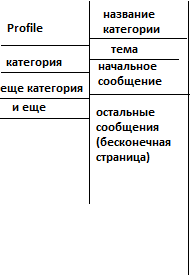

# Техническое задание

1. Project Name: WTForum
2. Authors:
    - Team Lead: Беликов Андрей
    - Project Developers: Челноков Егор, Советов Егор
    - Teacher: Анатольев Алексей Владимирович
3. Description of the program.
      >- Форум будет базироваться на web-сайте. Он будет поделен на различные темы для общения и обсуждения их.
      На стартовой странице пользователю будет предложен вход анонимно, зарегистрироваться или войти, если аккаунт уже был создан ранее.
      При успешном прохождении первой страницы, пользователь будет попадать на главную страницу.
      На главной странице пользователь может выбрать интересующую его тему (и в ней общаться),
      перейти в свой профиль, либо же при нахождении ошибки, написать на служебную почту.
      Темы будут определены заранее, разработчиками.
      Профиль пользователя будет содержать: никнейм, ранг (сл. пункт), избранные сообщения, а также кнопка смены пароля.
      В WTForum будет реализована ранговая система. Всего будет 4 ранга, 3 из них возможно достичь обычному пользователю,
      4 отдается модераторам. Первый - самый простой, имеет минимальный функционал, присваивается всем пользователь заседшим анонимно.
      Ограничения будут на скорость отправки сообщения на форуме, а также невозможность отправки ссылок и прочих отличных от текста форматов.
      Второй - присваивается только зарегистрированным пользователям, дает множество возможностей, таких как:
      отправка множества известных форматов (jpg, mp3, mp4, wav и тд), нет огранияение на скорость отправки,
      а также возможность ссылаться на какой либо ресурс. Третий - самый прокаченный по сравнению с двумя прошлыми.
      Дается толлько отличившимся пользователям. Дает персонально-индивидуальную цветовую настраойку сайта,
      а также цветную рамку вокруг сообщения пользователя.
      >- I. На форуме будет представленно 7 основных тем. Истории, Авто, IT, Новости, Обучение, Спорт, Видеоигры. Также будут страницы:
      входа, профиля и начального экрана, т.е. 10 страниц.
      >- II. На сайте будет реализована headers (https://getbootstrap.com/docs/5.3/examples/headers/),
      sidebars (https://getbootstrap.com/docs/5.3/examples/sidebars/) и может быть регистрация (https://getbootstrap.com/docs/5.3/examples/sign-in/)
      >- III. https://getbootstrap.com/docs/5.3/examples/headers/, https://getbootstrap.com/docs/5.3/examples/sidebars/,
      https://getbootstrap.com/docs/5.3/examples/sign-in/
      >- IV. Пользователь будет обязан ввести свою почту или id в телеграмме для восстановления пароля.
      >- V. Зарегистрированный пользователь может поместить фотку себе на автарку.
      >- VI. Возможно понадобятся: http://numbersapi.com/, http://jservice.io, https://http.cat,
      https://belikebill.ga/billgen-API.php?default=1&name=Otter, https://official-joke-api.appspot.com/random_joke,
      https://rickandmortyapi.com.
      >- В процессе работы сайта будут сохраняться в виде файлов: видео, картинки, звук. 
      В базе данных будут хранится все сообщения и ссылки пользователей.
4. >- 
5. ff
6. Graphical interface.
      >- 
      >- 
      >- 
      >- 
7. Deadlines.

| Задача                            | Дедлайн |
|-----------------------------------|---------|
| Создание команд. Описание проекта | 02.03   |
| Задание тз                        | 09.03   |
| Часть задания выполнена           | 16.03   |
| Работающая часть проекта          | 23.03   |
| Пояснительная записка             | 30.03   |
| Презентация, почти все работает   | 13.04   |
| Все готово                        | 23.04   |
| Защита                            | 24.04   |
