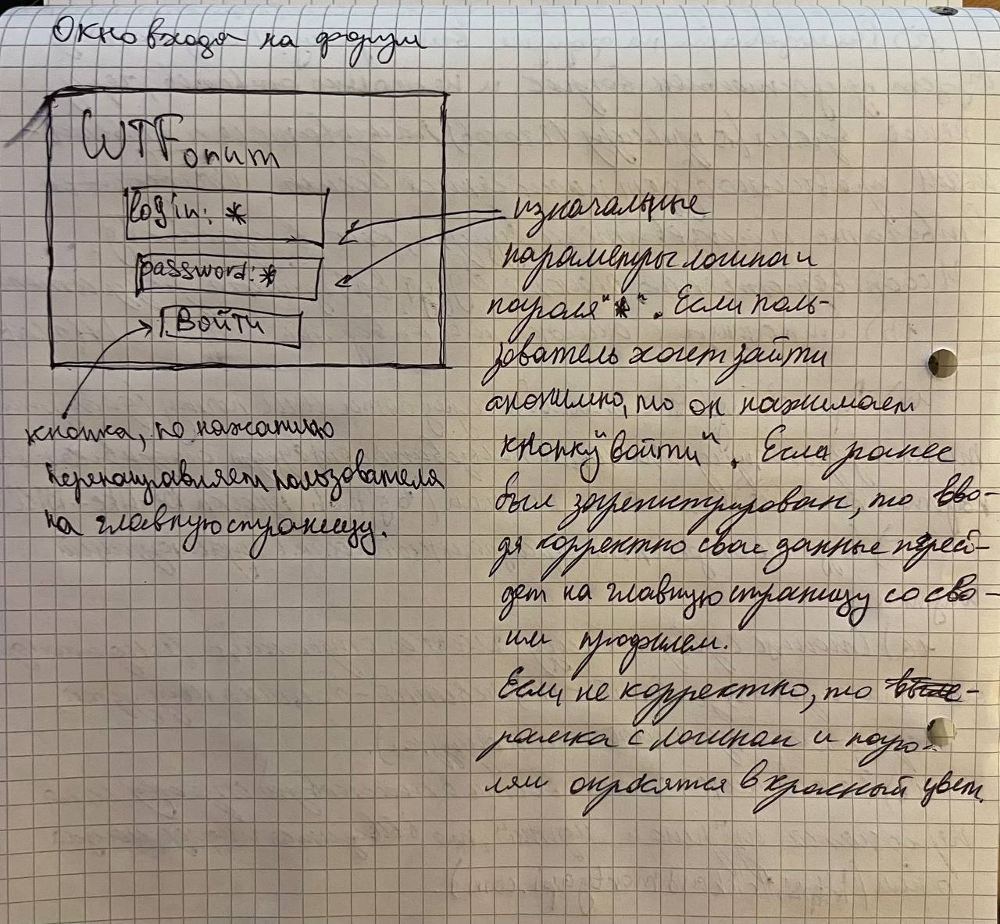
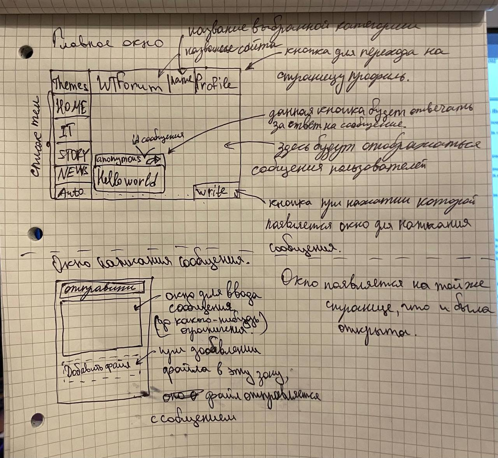
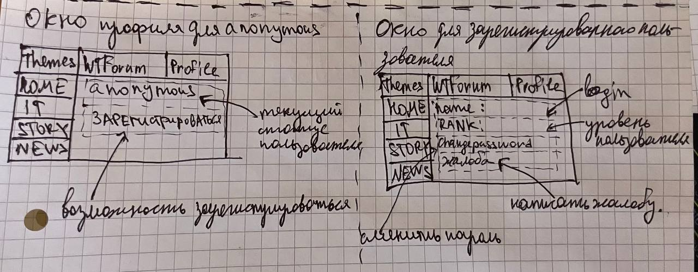
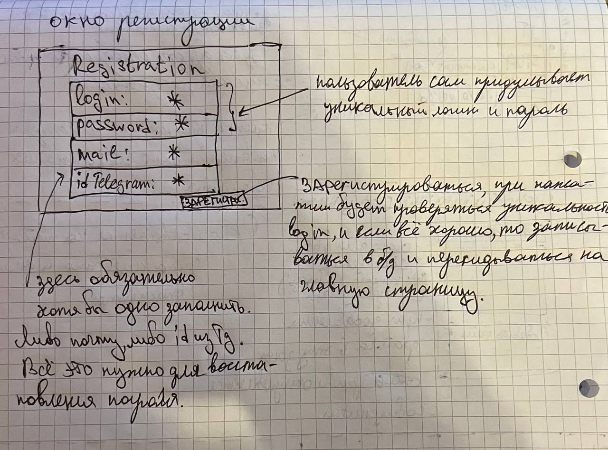

# Техническое задание

1. Project Name: WTForum
2. Authors:
    - Team Lead: Беликов Андрей
    - Project Developers: Челноков Егор, Советов Егор
    - Teacher: Анатольев Алексей Владимирович
3. Description of the program.
      >- Форум будет базироваться на web-сайте. Он будет поделен на различные темы для общения и обсуждения их.
      На стартовой странице пользователю будет предложено зарегистрироваться или войти, если аккаунт уже был создан ранее.
      При успешном прохождении первой страницы, пользователь будет попадать на главную страницу.
      На главной странице пользователь может выбрать интересующую его тему (и в ней общаться) или
      перейти в свой профиль.
      Темы будут определены заранее, разработчиками. Но также есть возможность предложить пользователю новвую тему.
      Профиль пользователя будет содержать: никнейм, почту, дата регистраци и сменить аватарку.
      В WTForum будет реализована ранговая система. Каждому юзеру дается возможность смотреть, а также писать. Но есть возможность повысить
      уровень до модератора.
      >- I. На форуме всего 5 страниц: Регистрация, Авторизация, Главная страница, Общие вопросы (тема) и профиль.
      >- II. На сайте будет реализована headers (https://getbootstrap.com/docs/5.3/examples/headers/),
      sidebars (https://getbootstrap.com/docs/5.3/examples/sidebars/) и может быть регистрация (https://getbootstrap.com/docs/5.3/examples/sign-in/)
      >- III. Для сайта мы используем формы авторизации и регистрации.
      >- IV. Пользователь будет обязан ввести свою почту, никнейм и пароль.
      >- V. Зарегистрированный пользователь может поместить фотку себе на автарку.
      >- VI. Мы использовали http://api.weatherapi.com/v1/current.json.
      >- VII. В процессе работы сайта будут сохраняться фотки пользователей в папке static/uploads/avatars, а также путь до этого файла в базе данных.
4. >- 
5. Program code plan.
      - Какие библиотеки могут пригодиться?
      >- Flask;
      >- Flask-sqlalchemy;
      >- Datetime;
      >- Flask-Login;
      >- Flask-SocketIO;
      >- Jinja2;
      >- requests;
      >- slugify;
      >- sqlalchemy-serializer;
      >- WTForms;
      >- psycopg2-binary;
      >- SQLAlchemy;
      >- Werkzeug;
      - Что и сколько (примерно) понадобиться в проекте?
      >- Понадобятся библиотеки, классы и функции;
      - Как будут связаны классы?
      >- Через главную директорию;
      - Нужны ли глобальные переменные и почему?
      >- Да, для настройки API, Flask-Login, логгера, Flask и socketio;
6. Graphical interface.
      >- 
      >- 
      >- 
      >- 
7. Deadlines.

| Задача                                 | Дедлайн  |
|----------------------------------------|----------|
| Проработка ТЗ, требований к проекту    | 5-7 дней |
| Разработка GUI                         | 5-7 дней |
| Проектирование БД                      | 3-5 дней |
| Разработка основного бэкенда           | 10 дней  |
| Работа с админ-панелью                 | 5-6 дней |
| Тестирование, устранение багов         | 4-5 дней |
| Создание документации к проекту, сдача | 3-4 дня  |
